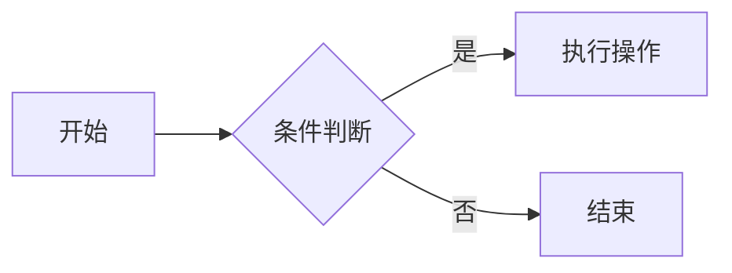

<!-- 博文预览图 -->

{: .shadow }
_图 1. 博文封面_

## 目录

1. [简介](#简介)
2. [安装与配置](#安装与配置)
3. [代码示例](#代码示例)
4. [数学公式演示](#数学公式演示)
5. [流程图与示例视频](#流程图与示例视频)
6. [音频演示](#音频演示)
7. [结语](#结语)

---

## 简介

这是一个基于 Chirpy 主题的完整博文示例，演示 Front Matter、图片、代码、数学公式、Mermaid 图表、视频与音频嵌入等功能。

## 安装与配置

在根目录执行：

```bash
# 安装主题
bundle add jekyll-theme-chirpy
# 创建新文章
jekyll post "一次完整的 Chirpy 博文示例"
```

然后在 `_posts/2025-04-30-一次完整的-chirpy-博文示例.md` 中按示例填入 Front Matter。

## 代码示例

演示行号、文件名与内联代码：

```javascript file="src/app.js"
// src/app.js
function greet(name) {
  console.log(`Hello, ${name}!`);
}
greet('Chirpy');
```

内联示例：运行 <code>`npm run build`</code> 可以生成生产包。

## 数学公式演示

行内公式：$$ E = mc^2 $$

块级公式：

$$
\begin{equation}
  \nabla \cdot \mathbf{E} = \frac{\rho}{\varepsilon_0}
  \label{eq:maxwell}
\end{equation}
$$

引用方程 \eqref{eq:maxwell}。

## 流程图与示例视频





## 音频演示



## 结语

以上便是一篇完整的 Chirpy 博文示例，涵盖常用的多媒体与扩展语法功能，助你快速上手主题创作。
```

